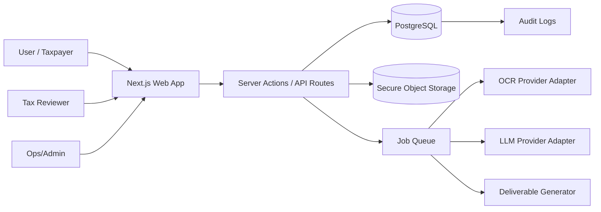
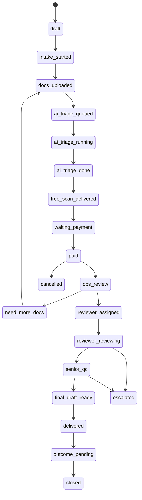

# 02 — System Architecture

## Architecture goals

The system should be:

- **durable**: schemas, state machine, and audit logs should survive product evolution;
- **efficient**: start simple with a monolith + worker; avoid overengineering;
- **safe**: sensitive documents, role-based access, and no unlogged reviewer actions;
- **AI-provider agnostic**: LLM/OCR providers must be swappable;
- **workflow-first**: optimize for structured case production and reviewer efficiency.

## High-level architecture



## Recommended stack

### MVP stack

- **App**: Next.js App Router + TypeScript.
- **DB**: PostgreSQL.
- **ORM**: Prisma or Drizzle. Pick one. Use typed migrations.
- **Auth**: Supabase Auth, Clerk, or NextAuth. Prefer Supabase if using Supabase Storage.
- **Storage**: private object storage with signed URLs.
- **Jobs**: DB-backed job table for MVP. Upgrade later to BullMQ/Redis or cloud queue.
- **AI**: LLM adapter interface with mock provider.
- **OCR**: OCR adapter interface with mock/manual fallback.
- **Payments**: payment adapter interface. Manual payment status for MVP; Xendit/Midtrans later.
- **Email**: adapter for Resend/Postmark/Mailgun; optional for MVP.

### Why not microservices initially?

The MVP is workflow-heavy and volume-light. A modular monolith is faster and safer. Split workers later when OCR/AI workload grows.

## Suggested repository structure

```text
tax-emergency-desk/
  apps/
    web/
      app/
        (public)/
        (auth)/
        dashboard/
        admin/
        reviewer/
        api/
      components/
      lib/
      styles/
      middleware.ts
  packages/
    core/
      src/
        domain/
        state-machine/
        validation/
        permissions/
    db/
      prisma/ or migrations/
      src/
    ai/
      src/
        providers/
        prompts/
        schemas/
        evaluators/
    ocr/
      src/
        providers/
        parsers/
    storage/
      src/
    payments/
      src/
    deliverables/
      src/
        markdown/
        html/
        pdf-later/
    config/
      src/
  scripts/
    seed.ts
    create-synthetic-case.ts
    run-ai-fixture.ts
  docs/
```

If using a single Next.js app only, keep the same module boundaries under `src/modules/*`.

## Core bounded contexts

### 1. Identity and access

Handles users, roles, reviewer permissions, and authorization.

Roles:

- `user`: taxpayer/customer.
- `ops`: internal operations.
- `tax_associate`: first-pass reviewer.
- `licensed_tax_consultant`: senior/final reviewer.
- `admin`: full admin.
- `support`: limited support.

### 2. Cases

A case is the central entity. Every document, AI run, task, review, payment, message, and deliverable belongs to a case.

Case types:

- `sp2dk_response`
- `coretax_error`
- `efaktur_error`
- `marketplace_tax_pack`
- `generic_tax_issue`

### 3. Documents

Handles secure upload, classification, extraction, storage, document pages, and source references.

Document categories:

- `sp2dk_letter`
- `coretax_screenshot`
- `efaktur_error_file`
- `invoice`
- `tax_invoice_faktur_pajak`
- `withholding_slip_bukti_potong`
- `bank_statement`
- `spt`
- `marketplace_report`
- `contract_po`
- `other`

### 4. AI processing

Provider-agnostic jobs that create structured outputs.

AI outputs must be:

- JSON-validated;
- linked to source documents;
- versioned;
- non-final unless reviewer-approved;
- auditable.

### 5. Review workflow

Human review, quality control, request-more-docs, approvals, rejection, escalation.

### 6. Payments and packages

Tracks selected package, invoice/payment state, and entitlement to reviewer workflow.

### 7. Deliverables

Generates final response pack in Markdown/HTML first. PDF export later.

### 8. Outcomes

After delivery, collect case outcome. This is critical for the long-term moat.

## Case state machine



### State definitions

- `draft`: case created, no substantial data.
- `intake_started`: user entered initial data.
- `docs_uploaded`: minimum documents uploaded.
- `ai_triage_queued`: AI job created.
- `ai_triage_running`: AI/OCR in progress.
- `ai_triage_done`: structured AI outputs ready.
- `free_scan_delivered`: user can view free summary.
- `waiting_payment`: user selected paid pack.
- `paid`: payment confirmed or manually marked.
- `ops_review`: ops checks completeness.
- `need_more_docs`: user must upload more documents.
- `reviewer_assigned`: reviewer assigned.
- `reviewer_reviewing`: active review.
- `senior_qc`: senior/qualified reviewer approval.
- `final_draft_ready`: approved deliverable ready.
- `delivered`: user can access deliverable.
- `outcome_pending`: waiting for user outcome feedback.
- `closed`: final state.
- `escalated`: case requires custom consultation.
- `cancelled`: cancelled/refunded/not proceeding.

## Job architecture

Use a simple table `jobs` for MVP.

Job types:

- `document.classify`
- `document.ocr`
- `case.ai_triage`
- `case.evidence_matrix`
- `case.draft_response`
- `case.hallucination_check`
- `deliverable.generate`
- `notification.email`
- `retention.delete_expired`

Every job has:

- id;
- type;
- status;
- payload JSON;
- attempts;
- locked_at;
- started_at;
- completed_at;
- error;
- created_by.

## AI provider abstraction

Define interfaces, not hard-coded providers.

```ts
export interface LlmProvider {
  generateStructured<T>(input: {
    system: string;
    prompt: string;
    schemaName: string;
    jsonSchema: unknown;
    temperature?: number;
    maxTokens?: number;
    metadata?: Record<string, string>;
  }): Promise<{ data: T; rawText: string; providerMeta: Record<string, unknown> }>;
}

export interface OcrProvider {
  extract(input: {
    storageKey: string;
    mimeType: string;
    pages?: number[];
  }): Promise<{ text: string; pages: OcrPage[]; providerMeta: Record<string, unknown> }>;
}
```

## Permission model

Use server-side authorization helpers for every route/action.

Basic rules:

- A `user` can access only their own cases and documents.
- `ops` can access cases assigned to them or all cases if permission flag allows.
- `tax_associate` can access assigned cases only.
- `licensed_tax_consultant` can access assigned cases and cases requiring senior QC.
- `admin` can access all.
- Signed document URLs must be short-lived.

## Error handling strategy

All AI/OCR failures should be recoverable:

- keep raw uploaded documents;
- mark job failed;
- show ops retry button;
- never delete partial outputs automatically;
- maintain audit log.

## Observability

Track:

- upload success/failure;
- OCR latency/cost;
- AI latency/cost;
- job failure rate;
- reviewer minutes per case;
- human correction rate;
- conversion events;
- data deletion events.

## External integrations in MVP

Allowed:

- Auth provider.
- Object storage.
- LLM/OCR provider.
- Payment provider placeholder/manual.
- Email provider.

Not allowed:

- Coretax/DJP login.
- Direct DJP submissions.
- Scraping tax portals.
- Storing user portal credentials.
