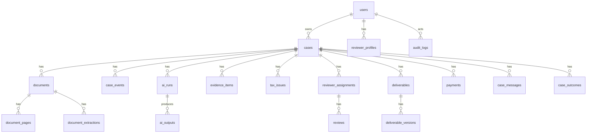

# 03 — Database Schema

This schema is intentionally explicit and workflow-first. Use it as a starting point for Prisma/Drizzle migrations.

## Entity relationship overview



## Enumerations

Implement as application enums + database check constraints.

```ts
export const CaseType = [
  'sp2dk_response',
  'coretax_error',
  'efaktur_error',
  'marketplace_tax_pack',
  'generic_tax_issue',
] as const;

export const CaseStatus = [
  'draft',
  'intake_started',
  'docs_uploaded',
  'ai_triage_queued',
  'ai_triage_running',
  'ai_triage_done',
  'free_scan_delivered',
  'waiting_payment',
  'paid',
  'ops_review',
  'need_more_docs',
  'reviewer_assigned',
  'reviewer_reviewing',
  'senior_qc',
  'final_draft_ready',
  'delivered',
  'outcome_pending',
  'closed',
  'escalated',
  'cancelled',
] as const;

export const UserRole = [
  'user',
  'support',
  'ops',
  'tax_associate',
  'licensed_tax_consultant',
  'admin',
] as const;

export const DocumentCategory = [
  'sp2dk_letter',
  'coretax_screenshot',
  'efaktur_error_file',
  'invoice',
  'tax_invoice_faktur_pajak',
  'withholding_slip_bukti_potong',
  'bank_statement',
  'spt',
  'marketplace_report',
  'contract_po',
  'identity_or_entity_document',
  'other',
] as const;

export const AiOutputType = [
  'document_classification',
  'sp2dk_extraction',
  'coretax_error_extraction',
  'issue_summary',
  'evidence_checklist',
  'draft_response_letter',
  'hallucination_check',
  'reviewer_brief',
] as const;
```

## PostgreSQL DDL sketch

> Adapt naming to Prisma/Drizzle conventions. Keep JSONB fields for provider outputs and evolving AI data, but avoid storing critical state only in JSON.

```sql
create extension if not exists "uuid-ossp";
create extension if not exists "pgcrypto";

create table app_users (
  id uuid primary key default uuid_generate_v4(),
  auth_provider text not null default 'local',
  auth_subject text unique,
  email text unique not null,
  full_name text,
  phone text,
  role text not null default 'user',
  is_active boolean not null default true,
  created_at timestamptz not null default now(),
  updated_at timestamptz not null default now(),
  constraint app_users_role_chk check (role in ('user','support','ops','tax_associate','licensed_tax_consultant','admin'))
);

create table reviewer_profiles (
  id uuid primary key default uuid_generate_v4(),
  user_id uuid not null references app_users(id),
  reviewer_type text not null,
  license_number text,
  sikop_status text,
  specialties text[] not null default '{}',
  max_cases_per_day int not null default 5,
  is_available boolean not null default true,
  metadata jsonb not null default '{}',
  created_at timestamptz not null default now(),
  updated_at timestamptz not null default now(),
  constraint reviewer_profiles_type_chk check (reviewer_type in ('tax_associate','licensed_tax_consultant','specialist'))
);

create table cases (
  id uuid primary key default uuid_generate_v4(),
  owner_user_id uuid not null references app_users(id),
  case_type text not null,
  status text not null default 'draft',
  title text,
  taxpayer_type text,
  taxpayer_name text,
  taxpayer_npwp_hash text,
  taxpayer_npwp_encrypted bytea,
  kpp_name text,
  tax_years int[] not null default '{}',
  tax_periods text[] not null default '{}',
  declared_deadline_date date,
  package_code text,
  complexity text not null default 'unknown',
  risk_level text not null default 'unknown',
  source_channel text,
  consent_version text,
  consented_at timestamptz,
  submitted_at timestamptz,
  delivered_at timestamptz,
  closed_at timestamptz,
  metadata jsonb not null default '{}',
  created_at timestamptz not null default now(),
  updated_at timestamptz not null default now(),
  constraint cases_case_type_chk check (case_type in ('sp2dk_response','coretax_error','efaktur_error','marketplace_tax_pack','generic_tax_issue')),
  constraint cases_status_chk check (status in ('draft','intake_started','docs_uploaded','ai_triage_queued','ai_triage_running','ai_triage_done','free_scan_delivered','waiting_payment','paid','ops_review','need_more_docs','reviewer_assigned','reviewer_reviewing','senior_qc','final_draft_ready','delivered','outcome_pending','closed','escalated','cancelled')),
  constraint cases_complexity_chk check (complexity in ('unknown','low','medium','high','out_of_scope')),
  constraint cases_risk_level_chk check (risk_level in ('unknown','low','medium','high','critical'))
);

create index cases_owner_idx on cases(owner_user_id);
create index cases_status_idx on cases(status);
create index cases_type_status_idx on cases(case_type, status);

create table documents (
  id uuid primary key default uuid_generate_v4(),
  case_id uuid not null references cases(id) on delete cascade,
  uploaded_by_user_id uuid not null references app_users(id),
  category text not null default 'other',
  original_filename text not null,
  storage_bucket text not null,
  storage_key text not null,
  mime_type text not null,
  file_size_bytes bigint not null,
  sha256_hash text not null,
  page_count int,
  language text default 'id',
  status text not null default 'uploaded',
  is_sensitive boolean not null default true,
  metadata jsonb not null default '{}',
  created_at timestamptz not null default now(),
  updated_at timestamptz not null default now(),
  constraint documents_category_chk check (category in ('sp2dk_letter','coretax_screenshot','efaktur_error_file','invoice','tax_invoice_faktur_pajak','withholding_slip_bukti_potong','bank_statement','spt','marketplace_report','contract_po','identity_or_entity_document','other')),
  constraint documents_status_chk check (status in ('uploaded','classified','ocr_pending','ocr_done','extraction_done','failed','deleted'))
);

create index documents_case_idx on documents(case_id);
create unique index documents_case_hash_idx on documents(case_id, sha256_hash);

create table document_pages (
  id uuid primary key default uuid_generate_v4(),
  document_id uuid not null references documents(id) on delete cascade,
  page_number int not null,
  text text,
  ocr_confidence numeric,
  image_storage_key text,
  metadata jsonb not null default '{}',
  created_at timestamptz not null default now(),
  unique(document_id, page_number)
);

create table document_extractions (
  id uuid primary key default uuid_generate_v4(),
  document_id uuid not null references documents(id) on delete cascade,
  extraction_type text not null,
  schema_version text not null,
  extracted_json jsonb not null,
  confidence numeric,
  source_refs jsonb not null default '[]',
  created_by_ai_run_id uuid,
  reviewed_by_user_id uuid references app_users(id),
  reviewed_at timestamptz,
  created_at timestamptz not null default now()
);

create table tax_issues (
  id uuid primary key default uuid_generate_v4(),
  case_id uuid not null references cases(id) on delete cascade,
  issue_code text not null,
  title text not null,
  description text,
  tax_type text,
  period text,
  severity text not null default 'unknown',
  confidence numeric,
  source_refs jsonb not null default '[]',
  status text not null default 'open',
  reviewer_notes text,
  created_at timestamptz not null default now(),
  updated_at timestamptz not null default now(),
  constraint tax_issues_severity_chk check (severity in ('unknown','low','medium','high','critical')),
  constraint tax_issues_status_chk check (status in ('open','needs_docs','resolved_in_pack','dismissed','escalated'))
);

create table evidence_items (
  id uuid primary key default uuid_generate_v4(),
  case_id uuid not null references cases(id) on delete cascade,
  tax_issue_id uuid references tax_issues(id) on delete set null,
  label text not null,
  description text,
  required boolean not null default true,
  status text not null default 'missing',
  related_document_id uuid references documents(id) on delete set null,
  source_refs jsonb not null default '[]',
  reviewer_notes text,
  created_at timestamptz not null default now(),
  updated_at timestamptz not null default now(),
  constraint evidence_status_chk check (status in ('missing','uploaded','insufficient','accepted','not_applicable'))
);

create table ai_runs (
  id uuid primary key default uuid_generate_v4(),
  case_id uuid references cases(id) on delete cascade,
  document_id uuid references documents(id) on delete cascade,
  run_type text not null,
  provider text not null,
  model text,
  prompt_version text not null,
  input_hash text,
  status text not null default 'queued',
  cost_estimate_usd numeric,
  token_input int,
  token_output int,
  latency_ms int,
  error_message text,
  started_at timestamptz,
  completed_at timestamptz,
  created_by_user_id uuid references app_users(id),
  created_at timestamptz not null default now(),
  constraint ai_runs_status_chk check (status in ('queued','running','succeeded','failed','cancelled'))
);

create table ai_outputs (
  id uuid primary key default uuid_generate_v4(),
  ai_run_id uuid not null references ai_runs(id) on delete cascade,
  case_id uuid references cases(id) on delete cascade,
  output_type text not null,
  schema_version text not null,
  output_json jsonb not null,
  raw_text text,
  confidence numeric,
  source_refs jsonb not null default '[]',
  is_visible_to_user boolean not null default false,
  created_at timestamptz not null default now(),
  constraint ai_outputs_type_chk check (output_type in ('document_classification','sp2dk_extraction','coretax_error_extraction','issue_summary','evidence_checklist','draft_response_letter','hallucination_check','reviewer_brief'))
);

create table reviewer_assignments (
  id uuid primary key default uuid_generate_v4(),
  case_id uuid not null references cases(id) on delete cascade,
  reviewer_user_id uuid not null references app_users(id),
  role_in_case text not null,
  status text not null default 'assigned',
  assigned_by_user_id uuid references app_users(id),
  assigned_at timestamptz not null default now(),
  completed_at timestamptz,
  constraint reviewer_assignments_role_chk check (role_in_case in ('first_pass','senior_qc','specialist')),
  constraint reviewer_assignments_status_chk check (status in ('assigned','accepted','declined','in_progress','completed','removed'))
);

create table reviews (
  id uuid primary key default uuid_generate_v4(),
  case_id uuid not null references cases(id) on delete cascade,
  assignment_id uuid references reviewer_assignments(id) on delete set null,
  reviewer_user_id uuid not null references app_users(id),
  review_type text not null,
  decision text not null,
  comments text,
  corrected_json jsonb,
  checklist_json jsonb not null default '{}',
  created_at timestamptz not null default now(),
  constraint reviews_type_chk check (review_type in ('first_pass','senior_qc','specialist','ops_completeness')),
  constraint reviews_decision_chk check (decision in ('approve','request_changes','request_more_docs','escalate','reject'))
);

create table deliverables (
  id uuid primary key default uuid_generate_v4(),
  case_id uuid not null references cases(id) on delete cascade,
  deliverable_type text not null,
  status text not null default 'draft',
  current_version_id uuid,
  approved_by_user_id uuid references app_users(id),
  approved_at timestamptz,
  delivered_at timestamptz,
  created_at timestamptz not null default now(),
  updated_at timestamptz not null default now(),
  constraint deliverables_type_chk check (deliverable_type in ('free_scan','response_pack','error_resolution_pack','marketplace_tax_pack')),
  constraint deliverables_status_chk check (status in ('draft','reviewing','approved','delivered','void'))
);

create table deliverable_versions (
  id uuid primary key default uuid_generate_v4(),
  deliverable_id uuid not null references deliverables(id) on delete cascade,
  version_number int not null,
  content_markdown text not null,
  content_html text,
  storage_key text,
  generated_by_ai_run_id uuid references ai_runs(id),
  created_by_user_id uuid references app_users(id),
  created_at timestamptz not null default now(),
  unique(deliverable_id, version_number)
);

create table payments (
  id uuid primary key default uuid_generate_v4(),
  case_id uuid not null references cases(id) on delete cascade,
  user_id uuid not null references app_users(id),
  package_code text not null,
  amount_idr bigint not null,
  status text not null default 'pending',
  provider text not null default 'manual',
  provider_reference text,
  paid_at timestamptz,
  metadata jsonb not null default '{}',
  created_at timestamptz not null default now(),
  updated_at timestamptz not null default now(),
  constraint payments_status_chk check (status in ('pending','paid','failed','expired','refunded','cancelled'))
);

create table case_messages (
  id uuid primary key default uuid_generate_v4(),
  case_id uuid not null references cases(id) on delete cascade,
  sender_user_id uuid references app_users(id),
  sender_type text not null,
  body text not null,
  visibility text not null default 'user_and_internal',
  metadata jsonb not null default '{}',
  created_at timestamptz not null default now(),
  constraint case_messages_sender_chk check (sender_type in ('user','ops','reviewer','system')),
  constraint case_messages_visibility_chk check (visibility in ('internal_only','user_and_internal'))
);

create table case_events (
  id uuid primary key default uuid_generate_v4(),
  case_id uuid not null references cases(id) on delete cascade,
  event_type text not null,
  from_status text,
  to_status text,
  actor_user_id uuid references app_users(id),
  payload jsonb not null default '{}',
  created_at timestamptz not null default now()
);

create table case_outcomes (
  id uuid primary key default uuid_generate_v4(),
  case_id uuid not null references cases(id) on delete cascade,
  reported_by_user_id uuid references app_users(id),
  outcome_type text not null,
  outcome_date date,
  notes text,
  attachments jsonb not null default '[]',
  normalized_json jsonb not null default '{}',
  created_at timestamptz not null default now(),
  constraint case_outcomes_type_chk check (outcome_type in ('accepted','request_more_docs','partially_resolved','unresolved','escalated_to_consultation','audit_started','unknown'))
);

create table jobs (
  id uuid primary key default uuid_generate_v4(),
  job_type text not null,
  status text not null default 'queued',
  priority int not null default 100,
  payload jsonb not null,
  attempts int not null default 0,
  max_attempts int not null default 3,
  locked_at timestamptz,
  locked_by text,
  started_at timestamptz,
  completed_at timestamptz,
  error_message text,
  created_at timestamptz not null default now(),
  updated_at timestamptz not null default now(),
  constraint jobs_status_chk check (status in ('queued','running','succeeded','failed','cancelled'))
);

create index jobs_queue_idx on jobs(status, priority, created_at);

create table consent_records (
  id uuid primary key default uuid_generate_v4(),
  user_id uuid not null references app_users(id),
  case_id uuid references cases(id) on delete cascade,
  consent_type text not null,
  consent_version text not null,
  granted boolean not null,
  ip_address inet,
  user_agent text,
  created_at timestamptz not null default now()
);

create table audit_logs (
  id uuid primary key default uuid_generate_v4(),
  actor_user_id uuid references app_users(id),
  action text not null,
  resource_type text not null,
  resource_id uuid,
  case_id uuid references cases(id) on delete set null,
  ip_address inet,
  user_agent text,
  payload jsonb not null default '{}',
  created_at timestamptz not null default now()
);

create index audit_logs_case_idx on audit_logs(case_id, created_at desc);
create index audit_logs_actor_idx on audit_logs(actor_user_id, created_at desc);
```

## Important design choices

### Hash + encrypted fields

For NPWP/NIK/bank account:

- store encrypted value only if necessary;
- store normalized hash for dedupe/search;
- never expose decrypted values outside necessary UI;
- avoid sending raw identifiers to AI unless necessary and consented.

### JSONB usage

Use JSONB for evolving AI outputs, but keep important state in typed columns:

- case type/status;
- document category/status;
- payment status;
- review decision;
- deliverable status.

### Source references

Every AI claim should use a standard source reference format:

```json
{
  "document_id": "uuid",
  "page_number": 1,
  "quote": "short extracted text only",
  "field": "sp2dk_letter.issue_text",
  "confidence": 0.86
}
```

Avoid storing long quotes in AI outputs; store extracted text in document pages/extractions and reference it.

## Data retention fields to add later

Optional table when retention needs expand:

```sql
create table data_retention_policies (
  id uuid primary key default uuid_generate_v4(),
  policy_code text unique not null,
  description text not null,
  retention_days int not null,
  applies_to text[] not null,
  created_at timestamptz not null default now()
);
```

MVP can implement retention with config constants and `retention.delete_expired` jobs.
