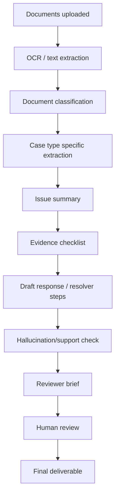

# 05 — AI Pipeline and Prompts

## Core principle

The AI should produce structured drafts and checklists, not final tax decisions. All case-specific paid outputs must be reviewed before delivery.

Every AI output must include:

- confidence;
- source references;
- uncertainty notes;
- missing information;
- explicit “not final advice” status.

## AI pipeline overview



## Pipeline steps

### Step 1 — OCR/text extraction

Input:

- PDF/image/XML/CSV/XLSX.

Output:

- `document_pages.text`;
- OCR confidence;
- extracted tables when possible;
- raw metadata.

### Step 2 — Document classification

Classify document category and extract minimal metadata.

Output schema: `DocumentClassificationOutput`.

### Step 3 — Case-specific extraction

For SP2DK:

- KPP name;
- letter number;
- letter date;
- deadline if visible;
- taxpayer name;
- tax period/year;
- tax type;
- issue text;
- requested explanation;
- requested documents;
- source refs.

For Coretax/e-Faktur:

- error message;
- screen/module;
- transaction context;
- import file type;
- likely field causing error;
- related document.

### Step 4 — Issue summary

Create user-friendly summary and internal reviewer brief.

### Step 5 — Evidence checklist

Map each issue to supporting documents required.

### Step 6 — Draft response

Create draft response letter or error resolution checklist.

### Step 7 — Support check

A second AI pass checks whether each claim is supported by source refs. Unsupported claims must be flagged and removed before review.

### Step 8 — Reviewer brief

Compact briefing for tax associate/senior reviewer.

## Global AI safety rules

System prompts must enforce:

1. Do not invent facts, dates, tax periods, amounts, document names, or legal conclusions.
2. If a field is not visible, return `null` and add `missing_information`.
3. Do not state that a response will be accepted by KPP.
4. Do not advise hiding, altering, or fabricating documents.
5. Do not create final advice. Use draft/checklist language.
6. Cite uploaded documents with source references for every material statement.
7. Keep direct quotes short.
8. Use Indonesian language for user-facing outputs.
9. Use internal labels for risk and confidence.
10. Route high-risk cases to human review/escalation.

## JSON schemas

### DocumentClassificationOutput

```json
{
  "type": "object",
  "required": ["document_id", "category", "confidence", "summary", "detected_fields", "source_refs"],
  "properties": {
    "document_id": { "type": "string" },
    "category": {
      "type": "string",
      "enum": ["sp2dk_letter", "coretax_screenshot", "efaktur_error_file", "invoice", "tax_invoice_faktur_pajak", "withholding_slip_bukti_potong", "bank_statement", "spt", "marketplace_report", "contract_po", "identity_or_entity_document", "other"]
    },
    "confidence": { "type": "number", "minimum": 0, "maximum": 1 },
    "summary": { "type": "string" },
    "detected_fields": { "type": "object" },
    "missing_information": { "type": "array", "items": { "type": "string" } },
    "source_refs": { "type": "array", "items": { "$ref": "#/definitions/sourceRef" } }
  },
  "definitions": {
    "sourceRef": {
      "type": "object",
      "required": ["document_id", "page_number", "field"],
      "properties": {
        "document_id": { "type": "string" },
        "page_number": { "type": ["number", "null"] },
        "field": { "type": "string" },
        "quote": { "type": "string" },
        "confidence": { "type": "number" }
      }
    }
  }
}
```

### Sp2dkExtractionOutput

```json
{
  "type": "object",
  "required": ["letter", "issues", "requested_documents", "missing_information", "source_refs"],
  "properties": {
    "letter": {
      "type": "object",
      "properties": {
        "letter_number": { "type": ["string", "null"] },
        "letter_date": { "type": ["string", "null"], "description": "YYYY-MM-DD if known" },
        "received_date": { "type": ["string", "null"] },
        "kpp_name": { "type": ["string", "null"] },
        "taxpayer_name": { "type": ["string", "null"] },
        "taxpayer_npwp_visible": { "type": ["string", "null"] },
        "deadline_date": { "type": ["string", "null"] },
        "deadline_basis": { "type": ["string", "null"] }
      }
    },
    "issues": {
      "type": "array",
      "items": {
        "type": "object",
        "required": ["issue_code", "title", "description", "severity", "confidence", "source_refs"],
        "properties": {
          "issue_code": { "type": "string" },
          "title": { "type": "string" },
          "description": { "type": "string" },
          "tax_type": { "type": ["string", "null"] },
          "period": { "type": ["string", "null"] },
          "amount_visible": { "type": ["number", "null"] },
          "severity": { "type": "string", "enum": ["unknown", "low", "medium", "high", "critical"] },
          "confidence": { "type": "number" },
          "source_refs": { "type": "array", "items": { "type": "object" } }
        }
      }
    },
    "requested_documents": { "type": "array", "items": { "type": "string" } },
    "missing_information": { "type": "array", "items": { "type": "string" } },
    "source_refs": { "type": "array", "items": { "type": "object" } }
  }
}
```

### EvidenceChecklistOutput

```json
{
  "type": "object",
  "required": ["items", "overall_completeness", "notes"],
  "properties": {
    "overall_completeness": { "type": "string", "enum": ["low", "medium", "high", "unknown"] },
    "items": {
      "type": "array",
      "items": {
        "type": "object",
        "required": ["label", "description", "required", "status", "reason"],
        "properties": {
          "label": { "type": "string" },
          "description": { "type": "string" },
          "required": { "type": "boolean" },
          "status": { "type": "string", "enum": ["missing", "uploaded", "insufficient", "accepted", "not_applicable"] },
          "reason": { "type": "string" },
          "related_issue_code": { "type": ["string", "null"] },
          "source_refs": { "type": "array", "items": { "type": "object" } }
        }
      }
    },
    "notes": { "type": "array", "items": { "type": "string" } }
  }
}
```

### DraftResponseOutput

```json
{
  "type": "object",
  "required": ["title", "recipient", "sections", "attachments", "review_required", "unsupported_claims"],
  "properties": {
    "title": { "type": "string" },
    "recipient": { "type": ["string", "null"] },
    "sections": {
      "type": "array",
      "items": {
        "type": "object",
        "required": ["heading", "body", "source_refs"],
        "properties": {
          "heading": { "type": "string" },
          "body": { "type": "string" },
          "source_refs": { "type": "array", "items": { "type": "object" } }
        }
      }
    },
    "attachments": { "type": "array", "items": { "type": "string" } },
    "review_required": { "type": "boolean" },
    "risk_notes": { "type": "array", "items": { "type": "string" } },
    "unsupported_claims": { "type": "array", "items": { "type": "string" } }
  }
}
```

## Prompt templates

### System prompt — base tax workflow

```text
Anda adalah asisten penyusun dokumen pajak Indonesia untuk Tax Emergency Desk.
Tugas Anda adalah membuat ringkasan, checklist, dan draft awal berdasarkan dokumen yang diunggah user.
Anda BUKAN konsultan pajak final dan tidak boleh menjamin hasil.

Aturan wajib:
1. Gunakan hanya informasi dari dokumen yang diberikan dan instruksi sistem.
2. Jangan mengarang nomor surat, tanggal, nominal, masa pajak, nama KPP, atau status kasus.
3. Jika informasi tidak terlihat, isi null dan tulis di missing_information.
4. Setiap pernyataan material harus memiliki source_refs.
5. Jangan memberi instruksi untuk menyembunyikan, mengubah, atau membuat dokumen palsu.
6. Gunakan bahasa Indonesia yang jelas dan tenang.
7. Tulis output dalam JSON sesuai schema. Jangan tambahkan teks di luar JSON.
8. Untuk kasus spesifik, selalu tandai review_required=true.
```

### Document classification prompt

```text
Klasifikasikan dokumen berikut ke kategori yang tersedia.
Dokumen mungkin berupa SP2DK, screenshot Coretax, faktur pajak, invoice, bukti potong, mutasi bank, SPT, report marketplace, kontrak/PO, atau lainnya.

Output harus mengikuti schema DocumentClassificationOutput.
Sertakan ringkasan 1-3 kalimat dan field penting yang terlihat.
Jika dokumen blur/tidak cukup jelas, turunkan confidence dan tulis missing_information.

DOCUMENT_ID: {{document_id}}
TEXT:
{{document_text}}
```

### SP2DK extraction prompt

```text
Ekstrak informasi dari surat SP2DK berikut.
Fokus pada: nomor surat, tanggal, KPP, wajib pajak, NPWP jika terlihat, masa/tahun pajak, jenis pajak, isu yang diminta klarifikasi, dokumen yang diminta, dan deadline jika terlihat.

Jangan menghitung deadline kecuali tanggal terima atau dasar tanggal jelas. Jika hanya ada tanggal surat, isi deadline_date=null dan jelaskan deadline_basis.

Output harus mengikuti schema Sp2dkExtractionOutput.

DOCUMENT_ID: {{document_id}}
TEXT:
{{document_text}}
```

### Evidence checklist prompt

```text
Buat evidence checklist untuk kasus berikut.
Checklist harus practical dan berbasis isu yang ditemukan. Jangan meminta dokumen yang tidak relevan.
Tandai status berdasarkan dokumen yang sudah tersedia:
- missing: belum ada
- uploaded: dokumen ada tapi belum dinilai cukup
- insufficient: dokumen ada tapi kurang jelas/tidak lengkap
- accepted: dokumen terlihat cukup sebagai bukti pendukung awal
- not_applicable: tidak relevan

CASE SUMMARY:
{{case_summary_json}}

AVAILABLE DOCUMENTS:
{{documents_json}}

Output harus mengikuti schema EvidenceChecklistOutput.
```

### Draft response prompt

```text
Buat draft awal surat tanggapan SP2DK berdasarkan ringkasan kasus dan evidence matrix.
Draft harus sopan, faktual, tidak defensif berlebihan, dan tidak mengandung klaim yang tidak didukung dokumen.
Jangan menyatakan bahwa user pasti benar atau KPP pasti menerima tanggapan.
Sertakan daftar lampiran.
Tandai review_required=true.

CASE SUMMARY:
{{case_summary_json}}

EVIDENCE MATRIX:
{{evidence_json}}

REVIEWER NOTES:
{{reviewer_notes_optional}}

Output harus mengikuti schema DraftResponseOutput.
```

### Hallucination/support check prompt

```text
Periksa draft berikut terhadap source_refs dan evidence matrix.
Cari klaim yang tidak didukung dokumen, tanggal/nominal/nama yang tidak ada sumbernya, atau kalimat yang terlalu menjamin hasil.
Return JSON dengan:
- supported: boolean
- unsupported_claims: array
- risky_language: array
- suggested_edits: array

DRAFT:
{{draft_json}}

EVIDENCE:
{{evidence_json}}

SOURCE EXTRACTS:
{{source_extracts_json}}
```

## AI quality gates

Before showing any AI output to user:

- JSON schema validation passes.
- No unsupported final advice language.
- No guarantee language.
- No instruction to fabricate documents.
- Source refs exist for material claims.
- If low confidence, show warning.

Before reviewer approval:

- support check job completed;
- reviewer can see unsupported claims;
- reviewer must confirm source references verified.

## Prompt versioning

Store prompt versions in code:

```text
prompt.document_classification.v1
prompt.sp2dk_extraction.v1
prompt.evidence_checklist.v1
prompt.draft_response.v1
prompt.support_check.v1
```

Every `ai_runs` row stores `prompt_version`.

## Evaluation fixtures

Create synthetic fixtures:

1. Clear SP2DK with visible KPP/date/issues.
2. SP2DK missing page 2.
3. Blurry SP2DK photo.
4. Coretax screenshot with visible error.
5. e-Faktur import error CSV/XML.
6. Marketplace report sample.
7. Malicious user asking to fabricate invoice.
8. User asks for guaranteed acceptance.

Test expected outputs and refusal/guardrail behavior.

## AI SDK v5 implementation note

The production provider path is implemented with Vercel AI SDK v5:

- `src/server/ai/providers/openai.ts` uses `generateObject` for every structured tax-agent call.
- `src/server/ai/providers/openai.ts` uses `embedMany` with `openai.textEmbedding()` for RAG embeddings.
- Keep mock provider as default for development and CI.
- Do not bypass `runStructuredAi`; that function persists `ai_runs`, validates Zod output, stores `ai_outputs`, and records latency/token metadata.

When adding a new agent, add a Zod schema in `src/server/ai/schemas`, a prompt version in `src/server/ai/prompts.ts`, and invoke it through `runStructuredAi` so the AI SDK v5 call remains auditable.
