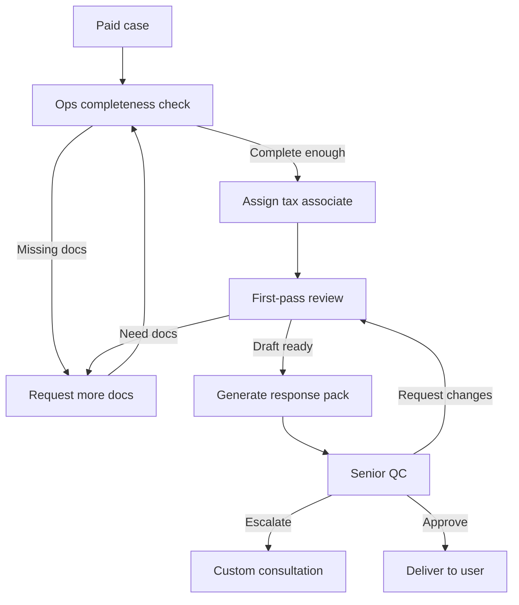

# 06 — Reviewer Workflow and Quality Assurance

## Reviewer network model

MVP reviewer setup:

- **1 senior licensed tax consultant**: quality owner, final approval for paid packs, template governance, escalation.
- **1 tax associate / junior reviewer**: first-pass review, evidence matrix, draft cleanup.
- **Ops/document analyst**: document completeness, user follow-up, formatting.

Scale later to 2–3 associates and a specialist panel.

## Role definitions

### Ops/document analyst

Can:

- inspect uploaded docs;
- classify documents;
- request missing docs;
- format deliverables;
- update administrative statuses.

Cannot:

- provide final tax opinion;
- approve response pack;
- represent user to DJP/KPP.

### Tax associate / first-pass reviewer

Can:

- review extraction accuracy;
- mark evidence sufficient/insufficient;
- edit draft response;
- suggest risk level;
- request more docs;
- prepare reviewer notes.

Cannot:

- be final approver unless also qualified/authorized;
- represent taxpayer without proper authority.

### Senior licensed tax consultant

Can:

- approve final reviewed response pack;
- mark case as high-risk/escalated;
- update templates/playbooks;
- provide final professional notes within scope;
- decide if case requires separate consultation/representation.

## Reviewer workflow



## SLA targets

MVP defaults:

- Free AI scan: under 15 minutes if automated; under 24 hours if manual fallback.
- Ops completeness check after payment: 1 business day.
- First-pass review: 1 business day.
- Senior QC: 1 business day.
- Reviewed response pack: target 2–3 business days after complete documents.

Urgent package can be priced separately only if reviewer capacity exists.

## Review checklist

Every paid response pack must pass:

### Source/evidence

- [ ] SP2DK metadata verified against uploaded document.
- [ ] Tax period/year verified.
- [ ] KPP/name/letter number verified.
- [ ] Deadline source verified or marked uncertain.
- [ ] Every material claim has document support.
- [ ] Unsupported AI claims removed.
- [ ] Missing documents clearly listed.

### Legal/tax risk language

- [ ] No guarantee of acceptance/outcome.
- [ ] No statement that user is definitively right unless evidence supports it and reviewer approves.
- [ ] No aggressive or accusatory language toward KPP.
- [ ] No instruction to fabricate/alter documents.
- [ ] Clear limitation: based on documents provided.

### Deliverable quality

- [ ] Executive summary clear.
- [ ] Issue-by-issue response clear.
- [ ] Attachment index matches documents.
- [ ] Next steps clear.
- [ ] User-facing language understandable.

### Escalation check

Escalate if:

- potential criminal tax risk;
- audit/pemeriksaan already started;
- large nominal exposure;
- transfer pricing/international tax;
- user admits false documents;
- user wants to hide income/transactions;
- reviewer cannot assess with provided docs.

## Case deliverable structure

### Reviewed SP2DK Response Pack

```text
1. Cover page
   - Case ID
   - Taxpayer name
   - Case type
   - Review status
   - Disclaimer

2. Executive summary
   - What SP2DK asks
   - Tax periods/types involved
   - Current document completeness
   - Suggested next step

3. SP2DK metadata
   - Letter number
   - Date
   - KPP
   - Deadline / uncertainty

4. Issue analysis
   - Issue 1
   - Source documents
   - Evidence available
   - Evidence missing
   - Risk note

5. Draft response letter
   - Formal letter draft
   - Body paragraphs
   - Closing

6. Attachment index
   - Lampiran 1: ...
   - Lampiran 2: ...

7. Reviewer notes
   - Caveats
   - Additional docs to prepare
   - When to consult further

8. Submission guidance
   - User submits via appropriate channel or authorized representative
   - Keep BPE/proof of submission
```

## Request-more-docs templates

### Bank statement missing

```text
Mohon upload mutasi rekening periode {{period}} karena SP2DK menyebut/menyinggung perbedaan data transaksi pada periode tersebut. Jika rekening lebih dari satu, upload semua rekening yang digunakan untuk transaksi usaha.
```

### Faktur pajak missing

```text
Mohon upload faktur pajak keluaran/masukan terkait periode {{period}} dan invoice yang menjadi dasar transaksi. Dokumen ini dibutuhkan untuk mencocokkan transaksi yang disebut dalam SP2DK.
```

### SPT missing

```text
Mohon upload SPT terkait periode/tahun pajak yang disebut di SP2DK, termasuk lampiran yang relevan jika ada.
```

## Reviewer QA metrics

Track per reviewer:

- average review time;
- cases completed;
- correction rate;
- senior QC pass rate;
- request-more-docs rate;
- escalation rate;
- user satisfaction;
- outcome feedback.

## Template governance

Only senior reviewer/admin can publish templates.

Template lifecycle:

- `draft`
- `internal_test`
- `active`
- `deprecated`

Every generated deliverable stores template version.

## Outcome feedback loop

After delivery, prompt user:

- Did you submit the response?
- Did KPP request more docs?
- Was the response accepted/closed?
- Was the case escalated?
- What additional docs were requested?

Store normalized outcome. Use it to improve checklists and templates. Do not expose case details publicly.
